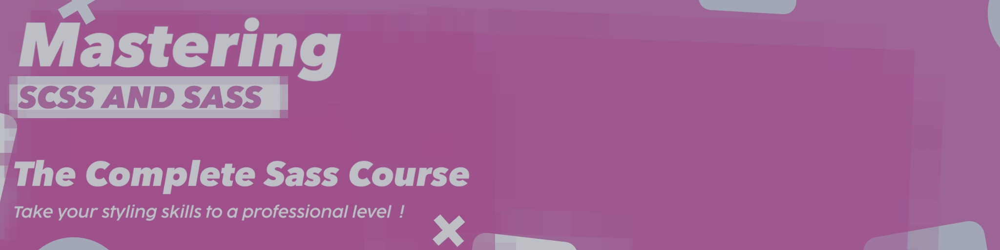

# Complete Sass/SCSS Learning Course 

## 🤖 Course Overview

#### A comprehensive Sass/SCSS course covering all concepts from fundamentals to advanced techniques.

#### 📂 Course Structure

```
01_import
02_Variables
03_Nesting
04_Property-Declarations
05_IfCondition
06_Interpolation
07_Mixin
08_Loop
09_Bootstrap-Grid-System
10_Function
11_Mixin-With-Content
```

### 🎯 Prerequisites

· Basic HTML & CSS knowledge 

· Code editor (VS Code recommended)

· Node.js (optional for compilation)

### 🚀 Getting Started

1. Clone the repository
2. Navigate to each lesson folder
3. Follow the lesson in numerical order
4. Practice with provided SCSS files

### 📖 How to Use This Course

· Start from lesson 01 and progress sequentially

· Each folder contains a complete lesson with examples

· Practice by modifying the examples

· Complete exercises at the end of each lesson

### 🛠️ Tools Needed

· Sass compiler (Dart Sass recommended)

· VS Code with Live Sass Compiler extension

· Terminal/Command line

### 📝 Note

Lessons are designed to build upon each other. Complete them in order for best results.
